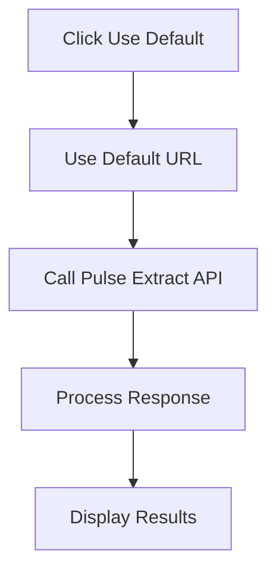
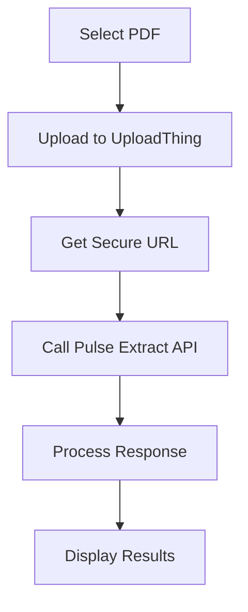

# Pulse API Document Extraction Demo

This Next.js application demonstrates secure document extraction using the Pulse API and UploadThing for file handling.

## Core Components

### Authentication (`src/lib/auth.ts`)

-   Secure admin-only access
-   Environment variables: `ADMIN_EMAIL` and `ADMIN_PASSWORD`
-   Session-based authentication with HTTP-only cookies

### File Upload (`src/app/api/uploadthing/`)

-   Uses UploadThing for secure file uploads
-   Handles PDF files up to 32MB
-   Returns secure URLs for uploaded files

### Pulse API Integration (`src/app/api/pulse/`)

-   Secure server-side API calls
-   Environment variable: `PULSE_API_KEY`
-   Handles extraction and polling for results

## Document Processing Routes

### Route 1: Default Document



Files involved:

1. `src/hooks/usePulseExtract.ts` - Manages extraction state
2. `src/app/api/pulse/extract/route.ts` - Handles Pulse API calls
3. `src/app/api/pulse/config.ts` - API configuration and types

### Route 2: File Upload



Files involved:

1. `src/hooks/useDocumentUpload.ts` - Manages upload state
2. `src/hooks/useUploadThing.ts` - Handles file uploads
3. `src/app/api/uploadthing/config.ts` - UploadThing configuration
4. `src/app/api/pulse/extract/route.ts` - Handles extraction

## Response Format

The application processes and displays:

-   Extracted text content
-   Tables (if present)
-   Raw data view (expandable)

## Security Features

1. Server-side API key handling
2. Secure file uploads via UploadThing
3. Admin-only access
4. HTTP-only session cookies
5. Environment variable configuration

## Environment Setup

Required environment variables:

```env
ADMIN_EMAIL=admin@example.com
ADMIN_PASSWORD=secure_password
PULSE_API_KEY=your_pulse_api_key
UPLOADTHING_SECRET=your_uploadthing_secret
UPLOADTHING_APP_ID=your_uploadthing_app_id
```
