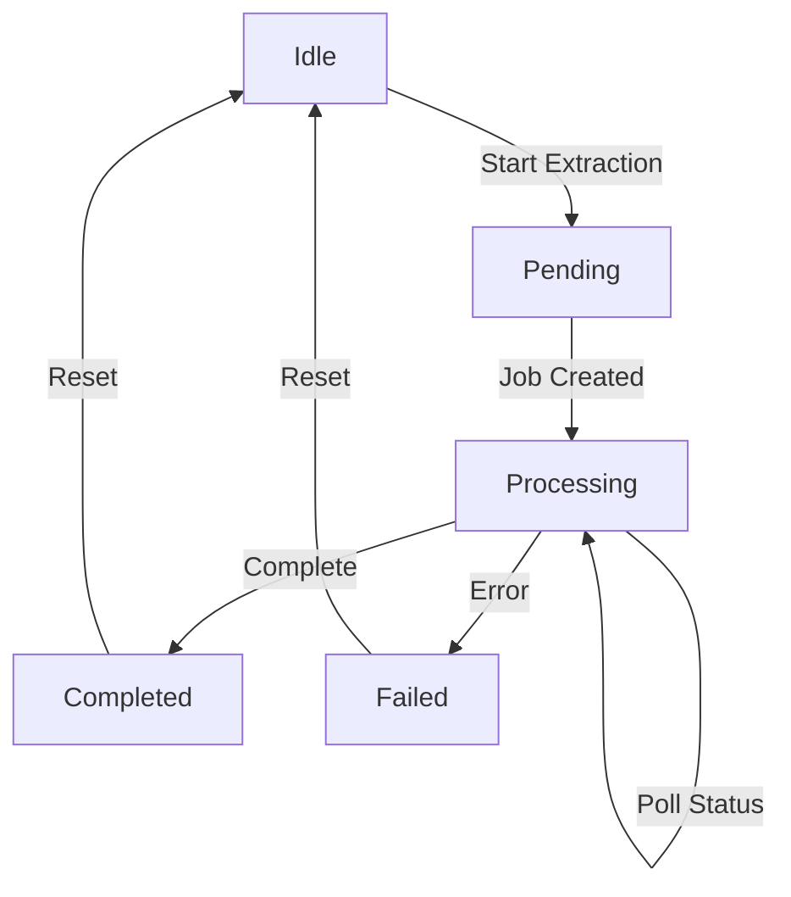

# Pulse Async Document Extraction

## API Endpoints

### Asynchronous Extraction

**File:** `src/app/api/pulse/extract_async/route.ts`

**Endpoint:** `POST /api/pulse/extract_async`

Initiates asynchronous document extraction for handling larger files or longer processing times.

#### Request Body

```typescript
{
	fileUrl: string // URL of the PDF file to process
}
```

#### Response Format

```typescript
{
	job_id: string // Unique identifier for tracking the extraction job
	status: "pending" // Initial status of the job
}
```

### Polling Endpoint

**File:** `src/app/api/pulse/poll/route.ts`

**Endpoint:** `GET /api/pulse/poll?jobId={job_id}`

Checks the status of an ongoing extraction job.

#### Response Format

```typescript
{
	status: "pending" | "completed" | "failed" | "cancelled"
	progress: number
	estimated_completion_time?: string
	result?: PulseExtractResponse
}
```

## Client Integration

### usePulseAsyncExtract Hook

**File:** `src/hooks/usePulseAsyncExtract.ts`

A React hook that manages the asynchronous document extraction workflow, including polling.

#### Hook Interface

```typescript
interface UsePulseAsyncExtractReturn {
	extractedData: PulseExtractResponse | null
	extractionStatus: string
	extractionState: ExtractionState
	jobId: string | null
	startAsyncExtraction: (fileUrl: string) => Promise<void>
	resetExtraction: () => void
}

type ExtractionState =
	| "idle"
	| "pending"
	| "processing"
	| "completed"
	| "failed"
```

#### usePulseAsyncExtract Hook Implementation

**File:** `src/hooks/usePulseAsyncExtract.ts`

```typescript
export const usePulseAsyncExtract = () => {
	const [extractedData, setExtractedData] =
		useState<PulseExtractResponse | null>(null)
	const [extractionStatus, setExtractionStatus] = useState<string>("")
	const [extractionState, setExtractionState] =
		useState<ExtractionState>("idle")
	const [jobId, setJobId] = useState<string | null>(null)
	const [pollInterval, setPollInterval] = useState<NodeJS.Timeout | null>(
		null
	)
	const [estimatedTime, setEstimatedTime] = useState<string | null>(null)

	const pollStatus = async (jobId: string) => {
		try {
			const response = await fetch(`/api/pulse/poll?jobId=${jobId}`)
			const data = await response.json()

			if (!response.ok) {
				throw new Error(data.error || "Failed to poll status")
			}

			if (data.status === "completed") {
				setExtractedData(data.result)
				setExtractionState("completed")
				setExtractionStatus("Extraction completed!")
				if (pollInterval) {
					clearInterval(pollInterval)
					setPollInterval(null)
				}
			} else if (data.status === "failed") {
				setExtractionState("failed")
				setExtractionStatus("Extraction failed")
				if (pollInterval) {
					clearInterval(pollInterval)
					setPollInterval(null)
				}
			} else {
				setExtractionStatus(
					`Processing document... ${Math.round(data.progress)}%`
				)
				if (data.estimated_completion_time) {
					setEstimatedTime(data.estimated_completion_time)
				}
			}
		} catch (error: any) {
			console.error("Polling error:", error)
			setExtractionState("failed")
			setExtractionStatus(`Polling failed: ${error.message}`)
			if (pollInterval) {
				clearInterval(pollInterval)
				setPollInterval(null)
			}
		}
	}

	const startAsyncExtraction = async (fileUrl: string) => {
		try {
			setExtractionStatus("Starting async extraction...")
			setExtractionState("pending")
			setExtractedData(null)

			const response = await fetch("/api/pulse/extract_async", {
				method: "POST",
				headers: { "Content-Type": "application/json" },
				body: JSON.stringify({ fileUrl }),
			})

			const data = await response.json()

			if (!response.ok) {
				throw new Error(
					data.error ||
						`Failed to start extraction: ${response.statusText}`
				)
			}

			if (!data.job_id) {
				throw new Error("No job ID returned from API")
			}

			setJobId(data.job_id)
			setExtractionStatus("Processing document...")
			setExtractionState("processing")

			// Start polling
			const interval = setInterval(() => pollStatus(data.job_id), 2000)
			setPollInterval(interval)
		} catch (error: any) {
			console.error("Extraction error:", error)
			setExtractionStatus(
				`Failed to extract: ${
					error.message || "Unknown error occurred"
				}`
			)
			setExtractionState("failed")
			setExtractedData(null)
		}
	}

	const resetExtraction = () => {
		setExtractionStatus("")
		setExtractedData(null)
		setExtractionState("idle")
		setJobId(null)
		if (pollInterval) {
			clearInterval(pollInterval)
			setPollInterval(null)
		}
	}

	// Cleanup on unmount
	useEffect(() => {
		return () => {
			if (pollInterval) {
				clearInterval(pollInterval)
			}
		}
	}, [pollInterval])

	return {
		extractedData,
		extractionStatus,
		extractionState,
		jobId,
		startAsyncExtraction,
		resetExtraction,
	}
}
```

#### Key Features

1. **State Management**

    - Tracks extraction data, status, and state
    - Manages polling interval
    - Stores job ID for status tracking

2. **Polling Logic**

    - Implements automatic polling every 2 seconds
    - Handles different status responses
    - Updates progress and estimated completion time
    - Automatically cleans up intervals

3. **Error Handling**

    - Comprehensive error catching
    - Status-specific error handling
    - Network error management
    - Polling failure recovery

4. **Resource Management**
    - Automatic cleanup on component unmount
    - Proper interval clearing
    - State reset functionality

#### Usage Example

```typescript
const {
	extractedData,
	extractionStatus,
	extractionState,
	startAsyncExtraction,
	resetExtraction,
} = usePulseAsyncExtract()

// Start async extraction
await startAsyncExtraction(fileUrl)

// Reset state and stop polling
resetExtraction()
```

#### Cleanup Management

```typescript
useEffect(() => {
	// Cleanup polling on unmount
	return () => {
		if (pollInterval) {
			clearInterval(pollInterval)
		}
	}
}, [pollInterval])
```

### Integration Example

```typescript
function AsyncDocumentProcessor() {
	const {
		extractedData,
		extractionStatus,
		extractionState,
		startAsyncExtraction,
	} = usePulseAsyncExtract()

	return (
		<div>
			<FileUploader
				onUpload={async (file) => {
					const fileUrl = await uploadFile(file)
					await startAsyncExtraction(fileUrl)
				}}
			/>
			<ExtractionProgress
				status={extractionStatus}
				state={extractionState}
			/>
			{extractedData && <ResultsView data={extractedData} />}
		</div>
	)
}
```

## Polling Strategy

### Interval Configuration

```typescript
const POLL_INTERVAL = 2000 // Poll every 2 seconds
const MAX_POLL_TIME = 300000 // Maximum polling time (5 minutes)
```

### States Flow



### Error Handling

```typescript
try {
	const response = await fetch(`/api/pulse/poll?jobId=${jobId}`)
	if (!response.ok) {
		throw new Error(`HTTP error! status: ${response.status}`)
	}
	// ... handle response
} catch (error) {
	setExtractionState("failed")
	setExtractionStatus(`Polling failed: ${error.message}`)
	clearInterval(pollInterval)
}
```

## Best Practices

1. Implement exponential backoff for polling
2. Set maximum polling duration
3. Handle network errors gracefully
4. Cleanup polling intervals on component unmount
5. Show clear progress indicators
6. Provide estimated completion time when available
7. Allow cancellation of ongoing extractions

## Configuration

### Environment Variables

```env
PULSE_API_KEY=your_pulse_api_key
PULSE_MAX_POLL_TIME=300000
PULSE_POLL_INTERVAL=2000
```

### Error States

```typescript
type PulseError = {
	message: string
	code: string
	details?: any
}

const handleExtractionError = (error: PulseError) => {
	switch (error.code) {
		case "TIMEOUT":
			setExtractionStatus("Extraction timed out")
			break
		case "INVALID_FILE":
			setExtractionStatus("Invalid file format")
			break
		default:
			setExtractionStatus(`Extraction failed: ${error.message}`)
	}
	setExtractionState("failed")
}
```
